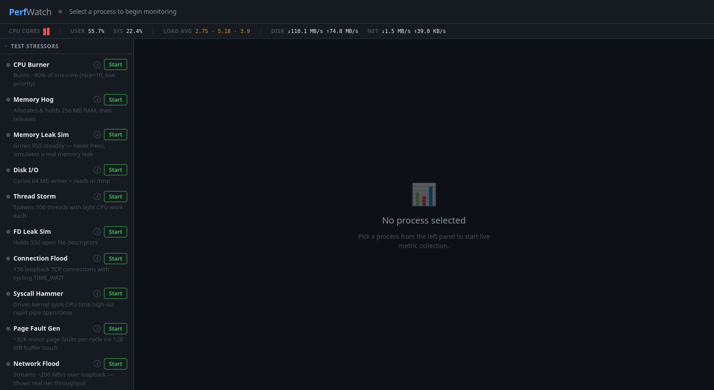
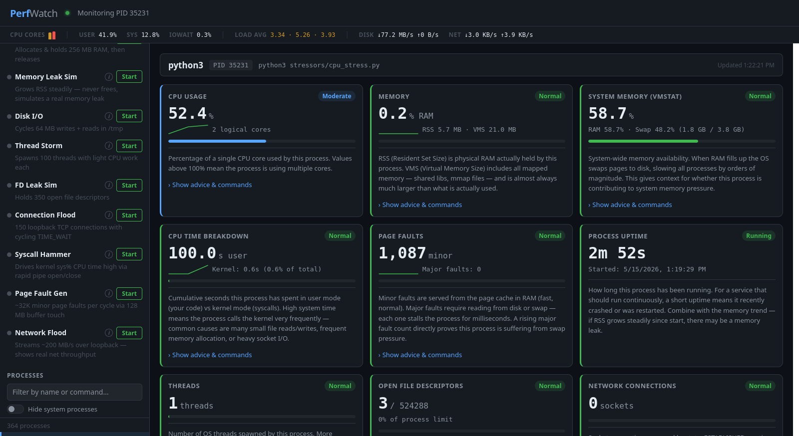
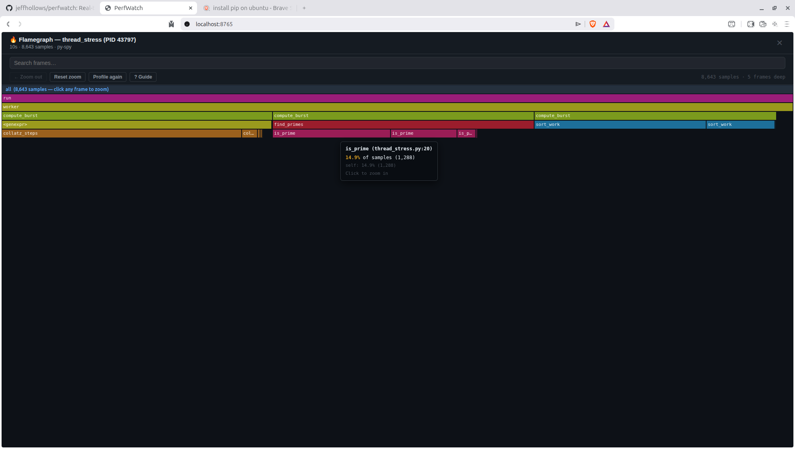

# PerfWatch

A real-time Linux process performance dashboard. Select any running process, watch its metrics update live, and get plain-English explanations for every number — including what "good" and "bad" look like, why a problem occurs, and what to do about it.

  





---

## Table of Contents

- [Quick Start](#quick-start)
- [Architecture](#architecture)
- [Implementation Details](#implementation-details)
- [Metrics Reference](#metrics-reference)
- [Flamegraph Profiling](#flamegraph-profiling)
- [Tutorial: Monitoring a Process](#tutorial-monitoring-a-process)
- [Tutorial: Using the Stress Tests](#tutorial-using-the-stress-tests)
- [What to Look For](#what-to-look-for)
- [The System Strip](#the-system-strip)
- [Stressor Reference](#stressor-reference)
- [Optional System Settings](#optional-system-settings)

---

## Quick Start

**Requirements:** Python 3.8+, `psutil` (`pip install psutil` or pre-installed on many distros)

```bash
git clone <repo>
cd perfwatch
python3 server.py
# Open http://localhost:8765
```

No other dependencies. No Flask, no FastAPI, no npm. Pure Python stdlib + psutil.

At startup, PerfWatch checks optional kernel settings and installed tools. If any are missing it prints a warning with the exact commands to fix them and asks whether to continue — you can always start without them and add them later.

---

## Architecture

PerfWatch is a single-file Python server and a single-file HTML/JS frontend.

```
perfwatch/
├── server.py          # HTTP + SSE server, all metric collection
├── static/
│   └── index.html     # Single-page app — all UI, CSS, and JS in one file
└── stressors/
    ├── run_stress.py       # CLI launcher for test processes
    ├── cpu_stress.py
    ├── mem_stress.py
    ├── leak_stress.py      # Simulates a memory leak (never frees)
    ├── io_stress.py
    ├── thread_stress.py
    ├── fd_stress.py
    ├── conn_stress.py
    ├── syscall_stress.py   # Drives kernel sys% CPU high via rapid pipe open/close
    ├── pagefault_stress.py # Generates ~32K minor page faults per cycle
    └── netflood_stress.py  # Streams ~200 MB/s over loopback (bandwidth test)
```

### Server

The server uses Python's stdlib `http.server.BaseHTTPRequestHandler` wrapped in a `ThreadingMixIn` so each connection gets its own thread. There is no async framework — threads handle concurrency.

```
Browser  ──GET /──────────────────▶  serve static/index.html
         ──GET /api/processes───────▶  JSON list of running processes
         ──GET /api/metrics?pid=X──▶  SSE stream (process metrics, 2s interval)
         ──GET /api/system──────────▶  SSE stream (system-wide metrics, 2s interval)
         ──GET /api/perf?pid=X──────▶  JSON one-shot perf stat result
         ──GET /api/profile?pid=X───▶  JSON flamegraph (folded stack format)
         ──GET /api/stressors───────▶  JSON stressor status
         ──POST /api/stressors/start▶  start a stressor subprocess
         ──POST /api/stressors/stop─▶  stop a stressor subprocess
```

### Real-time Streaming: Server-Sent Events (SSE)

Rather than polling (repeated `fetch()` calls) or WebSockets, PerfWatch uses [Server-Sent Events](https://developer.mozilla.org/en-US/docs/Web/API/Server-sent_events). The browser opens a persistent HTTP connection; the server writes newline-delimited `data: {...}\n\n` frames down it every 2 seconds.

Why SSE over WebSockets?
- **One-directional** — the server pushes data, the browser only needs to receive
- **HTTP native** — works through proxies, no upgrade handshake
- **Stdlib only** — no websockets library required; SSE is just a long-lived HTTP response

Each SSE endpoint runs in its own thread. Two streams run simultaneously when a process is selected: one for process metrics, one for system-wide metrics.

### Frontend

The frontend is a single HTML file with no build step, no framework, and no external assets. All CSS and JavaScript are inline. The app:

1. Polls `/api/processes` every 10 seconds to keep the sidebar list fresh
2. Opens an `EventSource` to `/api/metrics?pid=X` when a process is selected
3. Opens a persistent `EventSource` to `/api/system` at startup
4. Fetches `/api/perf?pid=X` once when a process is selected, then every 30 seconds

The metric cards use a diff-update strategy: on each tick the new card HTML is generated, compared to the existing DOM, and only changed values are patched in-place. Cards are only fully replaced when their severity classification changes (e.g. from "good" to "warning"). This avoids flicker and keeps animations smooth.

---

## Implementation Details

### psutil and the cpu_percent Gotcha

`psutil.Process.cpu_percent(interval=None)` measures CPU since the last call on the **same Process object**. The very first call always returns `0.0` — it has no previous sample to compare against.

PerfWatch handles this by creating one Process object at stream start, calling `cpu_percent()` once to prime it (discarding the result), and reusing that same object for every subsequent tick:

```python
proc = psutil.Process(pid)
proc.cpu_percent(interval=None)   # prime — always 0.0, discard it

while True:
    metrics = collect_metrics(pid, proc)  # reuse proc every 2s → correct %
    time.sleep(2)
```

If you create a new `Process` object every time (the natural mistake), CPU will always show 0%.

### Logical vs Physical I/O

`psutil` exposes `read_bytes` / `write_bytes` which are **physical** bytes — bytes that actually reached storage hardware. Writes to `/tmp` on most Linux systems land on `tmpfs` (a RAM-backed filesystem) and never hit a real disk, so `write_bytes` stays at 0.

To see the full picture, PerfWatch reads `/proc/<pid>/io` directly:

```
/proc/<pid>/io fields:
  rchar   — bytes read through the VFS layer (files, pipes, tmpfs, sockets)
  wchar   — bytes written through the VFS layer
  read_bytes  — bytes that actually hit storage hardware
  write_bytes — bytes that actually hit storage hardware
```

The Disk I/O card shows all four values so you can distinguish "the process is writing a lot" (high wchar) from "the disk is actually busy" (high write_bytes).

### Page Faults

psutil does not expose per-process page fault counts. PerfWatch reads them from `/proc/<pid>/stat` directly:

```
/proc/<pid>/stat fields (space-separated):
  field[9]  = minflt  (minor page faults — served from page cache, fast)
  field[11] = majflt  (major page faults — required disk/swap read, slow)
```

A rising **major** fault count is the most direct evidence that a process is actively swapping. Each major fault stalls the process for milliseconds while the kernel fetches the page from disk.

### System-Wide Rate Calculation

Disk and network metrics from psutil are **cumulative counters**, not rates. PerfWatch stores the previous snapshot with a timestamp and computes per-second rates on each tick:

```python
_prev_disk_io = {}  # device -> (counters, timestamp)

prev, t0 = _prev_disk_io[dev]
dt = now - t0
read_bps = (current.read_bytes - prev.read_bytes) / dt
```

The first tick returns no data (no previous snapshot). After 2 seconds, rates appear. Loop devices (snap mounts) are filtered with `_is_real_disk()` to avoid noise.

### Stressor Management

Stressors are launched as separate `subprocess.Popen` processes so each appears as an independent process in PerfWatch's process list. The server tracks them in a dict under a `threading.Lock`. On stop, the server sends `SIGTERM`; the stressor scripts handle it gracefully, closing sockets and files before exiting.

---

## Metrics Reference

| Card | Source | What it measures |
|------|--------|-----------------|
| CPU Usage | psutil | % of one CPU core used by this process |
| Memory | psutil | RSS (physical RAM held), VMS (virtual address space) |
| System Memory | psutil | System-wide RAM and swap usage |
| CPU Time Breakdown | psutil | Cumulative seconds in user mode vs kernel mode |
| Page Faults | /proc/pid/stat | Minor (RAM-served) and major (disk-served) page faults |
| Process Uptime | psutil | Time since process was started |
| Threads | psutil | Number of OS threads this process has spawned |
| Open File Descriptors | psutil | FDs open (files, sockets, pipes) vs process limit |
| Network Connections | psutil | TCP/UDP socket states (ESTABLISHED, TIME_WAIT, etc.) |
| Context Switches | psutil | Voluntary (process yielded) vs involuntary (OS preempted) |
| Scheduling Priority | psutil | nice value (-20 to +19) |
| Disk I/O | psutil + /proc/pid/io | Logical + physical read/write bytes, op counts |
| Open Files (lsof) | psutil | First 10 file paths open |
| Resource Limits | psutil | ulimit table: open files, processes, memory, stack, etc. |
| System Disk I/O | psutil | Per-device read/write bytes/s and IOPS |
| System Network I/O | psutil | Per-NIC throughput, error and drop counts |
| Perf Counters | perf stat | IPC, cache miss %, branch miss % (requires paranoid ≤ 1) |

---

## Flamegraph Profiling

Click the **Profile** button (visible when a process is selected) to capture a flamegraph — a visual representation of where the process spends its time, broken down by call stack.



### How it works

PerfWatch uses two profilers depending on the target process:

| Profiler | Used for | Requirement |
|----------|----------|-------------|
| **py-spy** | Python processes | `pip install py-spy`, `ptrace_scope=0` |
| **perf record** | Everything else (C, Rust, Go, Java, native apps) | `perf` installed, `perf_event_paranoid ≤ 1` |

py-spy is tried first. If it cannot identify the target as a Python process, PerfWatch automatically falls back to `perf record` with no user intervention required.

### Reading a flamegraph

- **Width** — proportion of time spent in that function (wider = more time)
- **Height** — call depth (bottom = entry point, top = leaf/hot function)
- **Click a frame** — zooms in to show that subtree in full width
- **Zoom out** — returns to the previous zoom level
- **Search box** — highlights all frames matching a name pattern
- **? Guide** — click to expand a full reading guide with tips inline

### Profiler selection and fallbacks

The subtitle below the flamegraph shows which profiler was used and how many samples were collected. A **low-sample warning** appears when fewer than 20 samples/second were collected — this usually means the process was mostly idle or in the kernel where symbols cannot be resolved.

### Sandboxed processes

Some processes cannot be profiled regardless of kernel settings:

- **Snap packages** — AppArmor + seccomp confinement blocks `perf_event_open` for all processes in the snap, including the main browser process
- **Flatpak apps** — similar namespace isolation
- **Chromium/Brave renderer and GPU processes** — Chrome's internal sandbox (separate from snap) also blocks perf

When PerfWatch detects this, it shows a clear error message and a `ps` command (with a **Copy** button) to find the unsandboxed parent process you can profile instead.

### perf and inline expansion

For native C/C++ processes (GNOME Shell, system daemons, etc.), PerfWatch runs `perf script --no-inline` to skip DWARF inline expansion. Without this flag, symbol resolution for heavily-optimized binaries can take 5+ minutes. The flag trades inline detail for speed — function names are still correct, inlined call sites just appear collapsed into their parent.

---

## Tutorial: Monitoring a Process

### Step 1 — Start the dashboard

```bash
cd perfwatch
python3 server.py
```

Open **http://localhost:8765** in your browser.

At startup the server checks kernel settings and prints a warning for any that need attention, then asks whether to continue. You can start without any optional settings — they only affect specific features.

### Step 2 — Find your process

The left sidebar lists all running processes sorted alphabetically. Use the search box to filter by **name, PID, or command line**. Toggle **Hide system processes** to remove root/daemon processes and focus on user processes.

> **Tip:** The process status badge shows `sleeping`, `running`, `zombie`, etc. Most processes spend most of their time `sleeping` — that is normal. A process is only `running` for the brief microseconds it's actually executing on a CPU. You will rarely see `running` in the list because the snapshot catches it mid-sleep.

### Step 3 — Select a process and watch it

Click any process. The main panel populates with live metric cards, updating every 2 seconds. Each card shows:

- **The number** in large font
- **A status badge** (Normal / Warning / Critical) color-coded by severity
- **A bar** showing utilization relative to a threshold
- **A sparkline** (on CPU, memory, CPU time, and page fault cards) — 60 samples of history, roughly the last 2 minutes
- **Show advice & commands** — click to expand plain-English explanations and the exact shell commands to investigate further

### Step 4 — Profile a process (flamegraph)

With a process selected, click the **Profile** button in the top-right toolbar. Choose a duration (5–30 seconds) and click **Start profiling**. A countdown runs, then PerfWatch generates a flamegraph showing exactly where CPU time was spent.

Click any bar to zoom into that subtree. Click **? Guide** to expand an inline reading guide.

### Step 5 — Read the system strip

The thin bar below the header updates every 2 seconds with system-wide data regardless of which process is selected:

- **CPU Cores** — one vertical bar per logical CPU; height = utilization
- **User / Sys / IOWait** — system-wide CPU time breakdown
- **Load Avg** — 1/5/15-minute load averages. A load above the number of CPU cores means work is queuing
- **Disk / Net** — total read/write throughput across all real disks and NICs

---

## Tutorial: Using the Stress Tests

PerfWatch ships with ten synthetic stressors so you can observe what each type of resource pressure looks like in the dashboard.

### From the dashboard

1. Click **⚗ Test Stressors** at the top of the left sidebar to expand it
2. Click **Start** next to any stressor
3. A PID link appears — click it to jump directly to monitoring that stressor process
4. Watch the relevant metric cards change
5. Click **Stop** to terminate it — the SSE stream closes and the process disappears from the list

Click the **ⓘ** button next to any stressor for a detailed explanation of what it does and exactly which cards to watch.

### From the terminal

```bash
cd stressors

python3 run_stress.py list          # show all stressors
python3 run_stress.py cpu           # start just the CPU stressor
python3 run_stress.py cpu mem io    # start three at once
python3 run_stress.py all           # start all ten
# Ctrl+C stops everything
```

---

## What to Look For

### High CPU Usage (>70%)

**Cards:** CPU Usage, CPU Time Breakdown, Context Switches

- If **involuntary context switches** are also high, the system is CPU-oversubscribed — more threads want to run than there are cores. Check load avg.
- If CPU is high but **IPC is low** (<0.5 in the Perf Counters card), the process is spinning in a tight loop but the CPU is stalled waiting on cache misses. The bottleneck is memory bandwidth, not raw compute.
- High **system %** in CPU Time Breakdown means the process is making many kernel calls (small reads/writes, frequent allocations, heavy socket I/O). Use `perf trace -p <pid>` to find the dominant syscall.

### Memory Growing Over Time

**Cards:** Memory, Page Faults, System Memory

- Watch **RSS** across multiple observations. Steady growth with no corresponding workload increase is a memory leak.
- **Major page faults** rising means the process is reading from swap. Each one stalls the process. If this number climbs, add RAM or reduce the process's footprint.
- When **System Memory** shows swap > 50%, all processes on the machine are degraded — swap is 100–1000× slower than RAM.

### Sluggish I/O

**Cards:** Disk I/O (per-process), System Disk I/O (system-wide)

- **Logical write** high but **Physical write** near zero: the process is writing to a RAM-backed filesystem (tmpfs, `/tmp`, `/dev/shm`). This is fast — not a real I/O bottleneck.
- **Physical write** growing: the process is hitting real storage. Check System Disk I/O for busy %; above 80% means the disk is saturated and requests are queuing.
- **iowait** in the system strip means CPUs are idle waiting on disk. This affects all processes, not just the one you're monitoring.

### Too Many Connections

**Cards:** Network Connections

- **ESTABLISHED** in the hundreds or thousands: check whether the application uses connection pooling. Unbounded growth is a connection leak.
- **CLOSE_WAIT** above ~20: the remote side closed the connection but this process has not called `close()`. This is almost always a bug — the process is ignoring EOF.
- **TIME_WAIT** in the thousands: connections are cycling fast. Tune `net.ipv4.tcp_fin_timeout` and `net.ipv4.tcp_tw_reuse` to reclaim ports faster.

### File Descriptor Leak

**Cards:** Open File Descriptors, Open Files (lsof)

- FD count **growing over time** with no corresponding growth in connections or file operations = leak. The process opens files or sockets and never calls `close()`.
- When the bar reaches 80%+ of the limit, new `open()` / `connect()` calls will fail with `EMFILE: Too many open files`. The application may silently start failing.
- Use `lsof -p <pid> | awk '{print $5}' | sort | uniq -c | sort -rn` to find what type of descriptor is leaking (REG = file, IPv4/IPv6 = socket, FIFO = pipe).

### Processes Being Preempted

**Cards:** Context Switches

- **Involuntary** switches count how many times the OS pulled this process off the CPU against its will to give another process a turn.
- A large involuntary count with high load average means the run queue is full. The fix is reducing the number of runnable threads, not tuning the process itself.
- **Voluntary** switches are normal — they happen whenever the process waits for I/O, sleeps, or explicitly yields.

### Resource Limit Surprises

**Card:** Resource Limits (ulimits)

- A **soft limit of 0** on anything except Core Dump means the process cannot use that resource at all. New FD opens fail immediately at a 0 open-file limit.
- **Open Files soft limit** of 1024 is the Linux default. High-concurrency servers (databases, web servers) routinely need 65536+. Raise it in `/etc/security/limits.conf`.
- The **hard limit** is the ceiling only root can raise. If the soft limit equals the hard limit, the process cannot self-elevate.

### Perf Counters: CPU Efficiency

**Card:** Perf Counters (requires `sudo sysctl kernel.perf_event_paranoid=1`)

| IPC range | Meaning |
|-----------|---------|
| < 0.5 | Very inefficient — likely memory-bound or waiting on I/O |
| 0.5 – 1.5 | Normal for mixed workloads |
| 1.5 – 3.0 | Good — code is keeping the pipeline full |
| > 3.0 | Excellent — wide superscalar execution, vectorized code |

- **Cache miss % > 10%**: the CPU is frequently reading from main RAM instead of cache. Reorganize data structures for locality (arrays instead of pointer-heavy trees, sequential access patterns).
- **Branch miss % > 5%**: the CPU's branch predictor is wrong often. Look for unpredictable `if` branches in hot loops; consider branchless alternatives or sorting data to make branches predictable.

---

## The System Strip

The thin bar at the top of the page shows system-wide health at a glance.

```
┌─────────────────────────────────────────────────────────────────────────┐
│ CPU Cores ████▌▌▌▌ │ User 12% │ Sys 3% │ Load Avg 0.78 · 0.48 · 0.67 │ Disk ↓0B/s ↑2.1MB/s │ Net ↓1.2KB/s ↑440B/s │
└─────────────────────────────────────────────────────────────────────────┘
```

- **CPU Cores** — each bar is one logical CPU. Height = utilization. Red bars = >80%, orange = >50%, green = normal.
- **Load Avg** — the three numbers are 1-minute, 5-minute, and 15-minute averages. A load higher than your CPU count means the system is oversubscribed. Load 2.0 on a 2-core machine = every core is at 100% with a queue of waiting work.
- **Disk** — aggregate read (↓) and write (↑) throughput across all real disks (loop/snap devices are excluded).
- **Net** — aggregate receive (↓) and transmit (↑) throughput across all non-loopback NICs.

---

## Stressor Reference

| Name | What it stresses | Cards to watch | Safe? |
|------|-----------------|----------------|-------|
| **CPU Burner** | One core at ~80% (nice=10) | CPU Usage, CPU Time Breakdown | ✓ Won't starve other processes |
| **Memory Hog** | 256 MB alloc/hold/release cycle | Memory, System Memory | ✓ Checks free RAM, pauses if low |
| **Memory Leak Sim** | +8 MB every 3s, never freed, cap 512 MB | Memory sparkline (upward trend) | ✓ Caps at 512 MB, checks free RAM |
| **Disk I/O** | 64 MB write+read cycle in /tmp | Disk I/O (logical high, physical ~0) | ✓ Writes to RAM (tmpfs), no disk wear |
| **Thread Storm** | 100 concurrent threads, light work | Threads, Context Switches | ✓ Capped at 150 threads |
| **FD Leak Sim** | Holds 350 /dev/null file handles | Open File Descriptors | ✓ No disk/memory consumed |
| **Connection Flood** | 150 loopback TCP connections | Network Connections | ✓ Loopback only, no external traffic |
| **Syscall Hammer** | 5000 pipe open/close per burst (~60% CPU) | CPU Time Breakdown (sys% spikes) | ✓ Duty-cycle throttled |
| **Page Fault Gen** | 128 MB buffer touched page-by-page, then freed | Page Faults (~32K minor faults/cycle) | ✓ No cumulative memory growth |
| **Network Flood** | Single loopback socket pair, up to ~200 MB/s | System Network I/O (bandwidth) | ✓ Loopback only, 1 socket pair (3 FDs) |

> **Note on Network Flood:** this stressor uses one socket pair — a listening server, an accepted connection, and a client socket (3 connections total). Its purpose is to drive **throughput** visible in the System Network I/O card, not to inflate the connection count. Use Connection Flood to see many simultaneous connections.

All stressors clean up their resources on stop and are designed to leave your system usable.

---

## Running Without psutil

If psutil is not available, install it:

```bash
pip install psutil
# or
pip3 install psutil
# or on Ubuntu/Debian:
apt-get install python3-psutil
```

To check if it's installed:

```bash
python3 -c "import psutil; print(psutil.__version__)"
```

---

## Optional System Settings

Several kernel settings and tools unlock additional PerfWatch features. PerfWatch checks all of them at startup and prints exactly what to run if anything is missing. None are required — PerfWatch runs fine without them.

### Flamegraph Profiling (Python) — `kernel.yama.ptrace_scope`

The **Profile** button uses [py-spy](https://github.com/benfred/py-spy) to sample call stacks of Python processes. py-spy reads process memory via `ptrace`. When `ptrace_scope=1` (the default), Linux restricts ptrace to parent→child relationships only, blocking py-spy from attaching to an already-running process.

Setting it to `0` allows any process to ptrace any other process **owned by the same user** — root is not required.

```bash
# Check current value
cat /proc/sys/kernel/yama/ptrace_scope
# 0 = unrestricted (same user)   1 = restricted (default)
# 2 = admin only                 3 = no ptrace at all

# Allow for this session only (resets on reboot)
sudo sysctl kernel.yama.ptrace_scope=0

# Make it permanent
echo 'kernel.yama.ptrace_scope = 0' | sudo tee /etc/sysctl.d/99-perfwatch.conf
sudo sysctl -p /etc/sysctl.d/99-perfwatch.conf
```

### Flamegraph Profiling (native) — `kernel.perf_event_paranoid` + `perf`

For non-Python processes (C, Rust, Go, native apps, GNOME Shell, etc.), PerfWatch falls back to `perf record`. Two things are needed:

1. **`perf` installed:** `sudo apt install linux-perf` (or `linux-tools-$(uname -r)`)
2. **`perf_event_paranoid ≤ 1`:** allows unprivileged process attachment

```bash
# Check current value
cat /proc/sys/kernel/perf_event_paranoid
# 4 = fully blocked   2 = default on Ubuntu   1 = allowed   -1 = unrestricted

# Allow for this session only (resets on reboot)
sudo sysctl kernel.perf_event_paranoid=1

# Make it permanent
echo 'kernel.perf_event_paranoid = 1' | sudo tee -a /etc/sysctl.d/99-perfwatch.conf
sudo sysctl -p /etc/sysctl.d/99-perfwatch.conf
```

### Flamegraph ring-buffer memory — `kernel.perf_event_mlock_kb`

`perf record` locks ring-buffer memory in RAM to prevent data loss during sampling. The kernel limits how much can be locked. On many systems the default (516 KB) is too low for profiling large processes like desktop apps.

```bash
# Check current value
cat /proc/sys/kernel/perf_event_mlock_kb

# Raise for this session only (resets on reboot)
sudo sysctl kernel.perf_event_mlock_kb=16384

# Make it permanent
echo 'kernel.perf_event_mlock_kb = 16384' | sudo tee -a /etc/sysctl.d/99-perfwatch.conf
sudo sysctl -p /etc/sysctl.d/99-perfwatch.conf
```

### Hardware Perf Counters — `kernel.perf_event_paranoid`

The **Perf Counters** card shows IPC, cache miss %, and branch miss % using `perf stat`. This requires the same `perf_event_paranoid ≤ 1` setting as native flamegraph profiling — one setting covers both features.

### Enable all at once

```bash
# Apply immediately (resets on reboot)
sudo sysctl kernel.yama.ptrace_scope=0 \
             kernel.perf_event_paranoid=1 \
             kernel.perf_event_mlock_kb=16384

# Make permanent
cat <<EOF | sudo tee /etc/sysctl.d/99-perfwatch.conf
kernel.yama.ptrace_scope = 0
kernel.perf_event_paranoid = 1
kernel.perf_event_mlock_kb = 16384
EOF
sudo sysctl -p /etc/sysctl.d/99-perfwatch.conf
```

> **Security note:** These settings apply system-wide, not just to PerfWatch. `ptrace_scope=0` allows any process you run to inspect the memory of your other processes. On a personal dev machine this is generally fine; on a multi-user or internet-exposed server, consider keeping the defaults and running PerfWatch as root only when profiling is needed.
